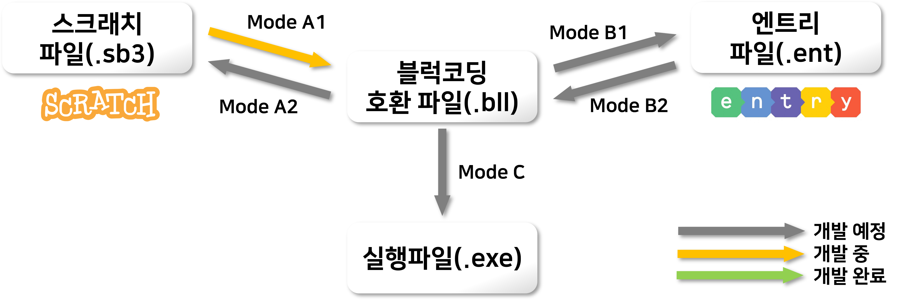

# 이 프로젝트는 현재 베타 버전입니다.
## 사용 시에 오류가 있을 수 있습니다. 자세한 사항은 주의사항 문서를 확인 바랍니다.

## 구조도


## CLI의 사용

### [주의사항 확인](/doc/warning_s2e.md)

### 명령어
- []안의 인자는 선택사항입니다.  
  
- 원본 소스코드 사용 시
```
python main.py in.sb3 [out.ent] [--options]
```
- 릴리즈 빌드 사용 시
```
ScratchEntry.exe in.sb3 [out.ent] [--options]
```
- 입력과 출력 파일의 확장자는 각각 sb3와 ent로 일치시켜야 합니다.  
- 출력 파일은 지정하지 않을 시 "<입력파일명>.ent"로 저장됩니다.  
- 옵션은 선택사항입니다. (아래 문단 참고)  

### 옵션
`--nocopymark`: 작품이 사본으로 표시되지 않습니다. 옵션이 없을 시 기본적으로 [이 프로젝트](https://playentry.org/project/69e605cea828571b688075c7)의 사본으로 표시됩니다.  
`--preserve`: 더미 덩어리(이벤트 블럭이 연결되지 않아 실행되지 않는 블럭)까지 모두 변환합니다. 옵션이 없을 시 결과에 더미 덩어리는 포함되지 않습니다.  
`--repboost`: 반복문의 속도를 높입니다. (버그성 기믹을 사용합니다)  
`--log=<n>`: 로그 표시 범위를 설정합니다. 
- 0(기본): 진행상황만 표시
- 1: 오류사항 표시
- 2: 간략한 내부 진행상황 표시
- ~~3: 모든 세부사항 표시 (오류 제보용)~~ (개발중)